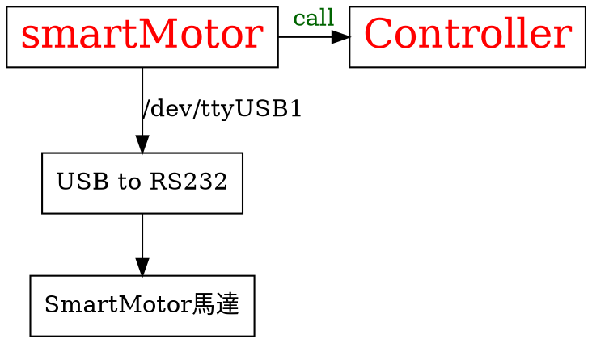

smart_motor (package name)
===
smartMotro馬達驅動，含速差計算。
## 1. 執行環境
執行於python3，下為建立python3虛擬環境的參考
```bash
sudo pip install virtualenv virtualenvwrapper
export WORKON_HOME=$HOME/.virtualenvs
source /usr/local/bin/virtualenvwrapper.sh
source ~/.profile
mkvirtualenv cv -p python3
```
Reference：
https://virtualenvwrapper.readthedocs.io/en/latest/command_ref.html
https://goo.gl/PdTF9o

## 2. 參數的設置
1. wheleDistance
	兩輪間之距離(單位 公尺)
2. wleleRadius
	輪半徑(單位 公尺)
## 3. 整體的架構
1. 使用usb2RS232，裝置預設在/dev/ttyUSB1，鮑率 9600
2. 有另外建立一 smartMotor 類別，專司與馬達通訊。

## 4. 演算法的參考
### 連續系統
http://blog.csdn.net/heyijia0327/article/details/47021861

### 離散系統


## 5. 參考資料
1. [控制example](https://github.com/paulmilliken/smart_motor/blob/master/src/Smartmotor.py) github他人寫的相似package
2. move_base教學 http://blog.csdn.net/heyijia0327/article/details/41823809
3. 馬達控制參考
```
	馬達給定數值，如要每秒轉一圈，則給於 32768 。
	V --> 1rps=60rpm=>32768
```
***
最新版請看
https://hackmd.io/s/SyFSnjY6
ROS-Bot計畫
https://hackmd.io/s/SJRJLO4a
